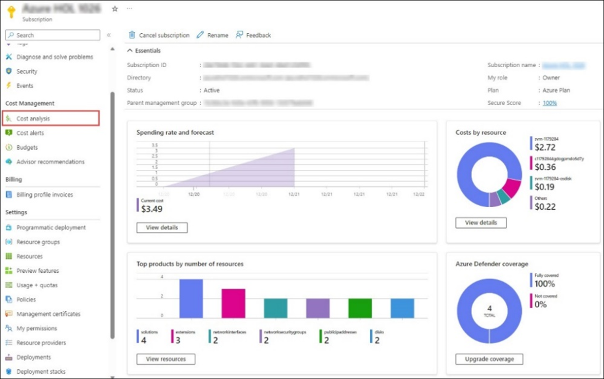

# Getting Started with Hackathon - Accenture 2024 Lab Environment
 
Using this environment, you’ll be able to explore complete features and offerings offered by Azure OpenAI. Please find the detailed overview of the sandbox environment below.

## About the Hackathon Environment
   | Resources | Value | Remarks |
   | --- | --- | --- |
   | Enabled Services | `Azure OpenAI`, `Other Azure Resources` | You can explore the any Azure services. |
   | Azure Credit | 500 USD | The consumption limit is set on Azure spend to 500 USD |
   | Credit Alerts | Credit Alerts are set on consumption of 50%, 75%, 80%, 95%, and 100% of total Azure credits. | Make sure to check your registered email's inbox for any alert-related mails. Alerts give you a head start to keep your Azure spending in control and to plan out the remaining credits in the best way possible. |
   | Sandbox Duration | 30 Days/720 Hours or until Azure Consumption Credits are exhausted. | The sandbox environment will be deleted automatically after 30 Days/720 Hours or once the Azure credits are exhausted, whichever comes first. |

1. Every team member gets their own Azure username and password, with owner access on 1 Azure subscription shared by entire team.

1. USD 500 Azure Credit limit is for entire team, not on individual basis.

1. You will have owner role access on the Azure subscription, granting you the freedom to explore the features of Azure OpenAI and other Azure Services. It is recommended to utilize this environment solely for learning purposes.

1. The Azure credit consumption encompasses the operational expenses of all the Azure resources. This Azure Credit consumption will not be used for any third-party subscription, licenses requested during sandbox and will be reserved only for Azure Resources.

1. It is recommended to use the trial version for any third-party subscriptions and licenses which are not offered by Microsoft.

1. Due to the sandbox's fixed budget of $500 USD, please refrain from deploying any resources unrelated to the Sandbox, as this will consume the Azure credit leading to the deallocation of the Sandbox as soon as the credit limit is reached.

### Cost Monitoring:
To monitor and analyse your Azure credit spend, you can navigate to the Azure Subscription page by following the steps mentioned below.

+ From Azure portal home page, search for **Subscriptions (1)** using the search bar and select the same from the suggestions.
  
  
  
+ Select Cost analysis tab from the Cost Management pane. You can access a comprehensive breakdown of your Azure spending, offering a granular view of costs associated with various services, and resources.

  

#### Best Practices:
+ **Resources usage:** Please stop the virtual machines and other resources when not in use to minimize the Azure spend.

+ **Azure Cost Analysis:** Maintain a practice of regularly checking the Cost Analysis report for the assigned Azure subscription to ensure the sustainability of the environment over an extended period.

+ **Alert notifications:** Make sure to check your registered email's inbox for any alert-related mails. Alerts give you can head start to keep your Azure spending in control and to plan out the remaining credits in the best way possible.

### Exploring Your Azure Credentials 
 
To get a better understanding of your lab resources and credentials, navigate to the **Environment** tab and copy the email/username and password to log in to the Azure portal.
 
   

### Login to Azure Portal
 
1. Access the Azure portal by opening your web browser and directing it to `https://portal.azure.com/`. Please use an InPrivate / Incognito Browser window.  
1. On the **Sign into Microsoft Azure** tab you will see the login screen, in that enter the following email/username and then click on **Next**.
   
     

     > **Note:** If you get a **Download Microsoft Edge mobile app** popup, then click on **Do not show** dropdown and select **Don't show this recommendation again**.
     
1. Now enter the following password and click on **Sign in**.
   
     
     
     > If you are presented with **Help us protect your account** dialog box, then select **Skip for now** option.

      

      > If you are presented with **Action Required** dialog box, then select **Ask later** option.

      
  
1. If you see the pop-up **Stay Signed in?**, click No

   

1. If you see the pop-up **You have free Azure Advisor recommendations!**, close the window to continue the lab.

1. If a **Welcome to Microsoft Azure** popup window appears, click **Maybe Later** to skip the tour.

   
 
1. Now you will see Azure Portal Dashboard, click on **Resource groups** from the Navigate panel to see the resource groups.

     
   
1. Confirm you have all resource group are present as shown below.

     
   

### CloudLabs Support Contacts
if you need any assistance, or you can contact CloudLabs 24*7 Support for any extra help.

+ **Email:** `event-support@spektrasystems.com`

+ **Live Chat:** `https://cloudlabs.ai/ms-support`

When you contact support, please provide the following information:
+  “I am participating in Hackathon - Accenture event, my registered email address is `email@accenture.com`, followed by your query/issue.  
